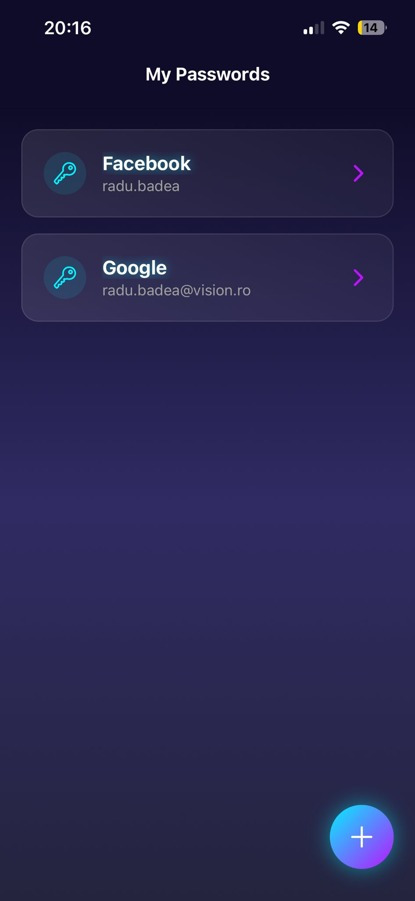
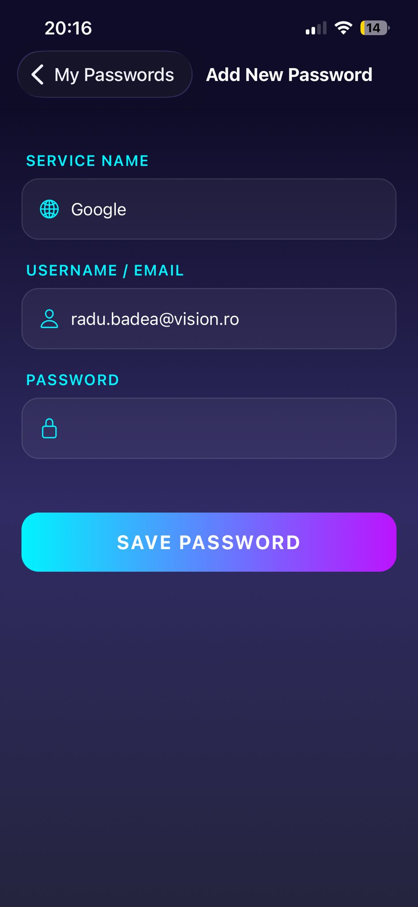
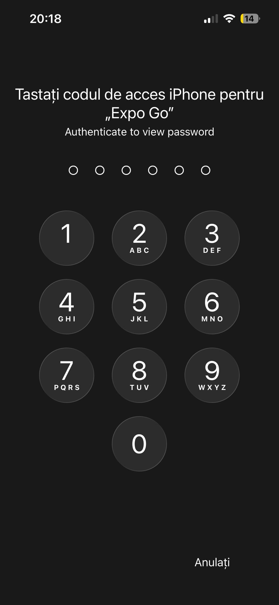

# MyPasswords - Manager de Parole Securizat

MyPasswords este o aplicație mobilă modernă și sigură, construită cu **React Native** și **Expo**, care îți permite să stochezi parolele importante direct pe telefonul tău. Aplicația pune accent pe securitate, utilizând stocare criptată și autentificare biometrică nativă (FaceID/TouchID), totul împachetat într-o interfață utilizator futuristă și fluidă.

## Funcționalități Principale

*   **Securitate Maximă**: Parolele sunt criptate și salvate folosind `expo-secure-store`, fiind accesibile doar de pe dispozitivul tău.
*   **Autentificare Biometrică**: Accesul la parole este protejat de securitatea telefonului (FaceID, TouchID sau codul de deblocare).
*   **Design Futurist**: Interfață "Glassmorphism" cu gradiente neon (Cyan & Pink), animații fluide și mod întunecat (Dark Mode) implicit.
*   **Management Simplu**: Adaugă, vizualizează, copiază și șterge parolele cu ușurință.
*   **Confidențialitate**: Datele nu părăsesc niciodată telefonul tău (aplicația funcționează complet offline).

---

## 📸 Galerie Foto

| Ecran Principal | Adăugare Parolă |
|:---:|:---:|
|  |  |

| Detalii & Acțiuni | Autentificare |
|:---:|:---:|
|  |  |

---

## Tehnologii Utilizate

Aplicația a fost dezvoltată folosind un stack modern de tehnologii mobile:

### Core
*   **[Expo](https://expo.dev/)**: Framework-ul principal pentru dezvoltare rapidă și compatibilitate cross-platform.
*   **[React Native](https://reactnative.dev/)**: Biblioteca de bază pentru interfața utilizator.
*   **[React Navigation](https://reactnavigation.org/)**: Pentru navigarea între ecrane (Native Stack).

### Securitate & Stocare
*   **`expo-secure-store`**: Folosit pentru a stoca parolele criptate în *Keychain* (iOS) sau *Keystore* (Android).
*   **`expo-local-authentication`**: Permite integrarea cu sistemele de securitate ale telefonului (FaceID/TouchID).
*   **`@react-native-async-storage/async-storage`**: Folosit pentru a stoca lista de metadate (nume serviciu, user) într-un mod eficient.
*   **`uuid`**: Pentru generarea de ID-uri unice pentru fiecare intrare.

### UI & UX
*   **`expo-linear-gradient`**: Pentru fundalurile și butoanele spectaculoase.
*   **`react-native` (Animated API)**: Pentru animațiile de intrare (Fade In) și tranziții.
*   **`@expo/vector-icons`**: Setul de iconițe (Ionicons) pentru un aspect curat.
*   **`expo-status-bar`**: Pentru controlul barei de stare.

---

## Cum a fost creată aplicația

Procesul de dezvoltare a urmat câțiva pași esențiali:

1.  **Inițializare**: Proiectul a fost generat folosind `npx create-expo-app`, configurând baza pentru React Native.
2.  **Implemetarea Stocării**:
    *   Am creat un serviciu `StorageService` care separă datele sensibile (parola) de cele publice (numele serviciului).
    *   Parolele sunt scrise direct în zona securizată a hardware-ului telefonului.
3.  **Design UI (Iterativ)**:
    *   Inițial, o interfață simplă funcțională.
    *   Ulterior, un redesign complet "Dark Mode" cu accente futuriste, folosind gradiente și componente transparente.
    *   Înlocuirea librăriilor instabile (`react-native-reanimated`) cu API-ul nativ `Animated` pentru stabilitate maximă.
4.  **Securitate**:
    *   Inițial am implementat un PIN custom.
    *   Ulterior, am migrat la **Autentificarea Biometrică Nativă** pentru o experiență mai fluidă și mai sigură.

---

## Ghid de Utilizare

### 1. Adăugarea unei parole
*   Apasă butonul flotant **(+)** din colțul dreapta-jos.
*   Completează **Numele Serviciului** (ex: Gmail), **Username-ul** și **Parola**.
*   Apasă **SAVE PASSWORD**. Parola va fi criptată instantaneu.

### 2. Vizualizarea unei parole
*   În ecranul principal, apasă pe oricare dintre cardurile listate.
*   Telefonul îți va cere să te autentifici (FaceID, Amprentă sau PIN-ul telefonului).
*   După autentificarea cu succes, un pop-up îți va arăta parola.

### 3. Copierea parolei
*   În fereastra de vizualizare, apasă butonul **Copy Password**. Parola este copiată în clipboard pentru a o putea folosi imediat.

### 4. Ștergerea unei parole
*   În fereastra de vizualizare (după autentificare), apasă butonul roșu **Delete**.
*   Confirmă acțiunea în fereastra următoare. Parola va fi ștearsă definitiv.

---

## 💻 Instalare și Rulare (Local)

Dacă dorești să rulezi proiectul pe calculatorul tău:

1.  Clonează proiectul.
2.  Instalează dependențele:
    ```bash
    npm install
    ```
3.  Pornește serverul de dezvoltare:
    ```bash
    npx expo start -c
    ```
4.  Scanează codul QR cu aplicația **Expo Go** (Android) sau folosește Camera (iOS).

> **Notă**: Pentru funcționalitatea completă a FaceID/TouchID, aplicația trebuie rulată pe un dispozitiv fizic, nu în simulator.
